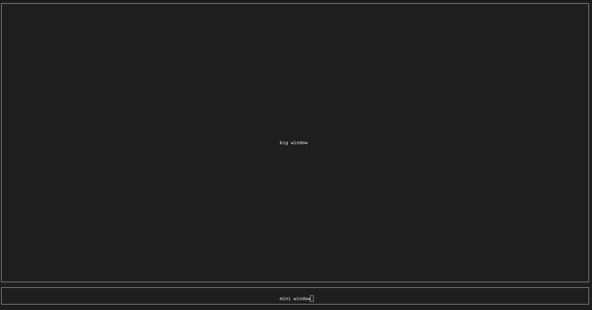

# Introduction

Ncurses is one of the most universal and tested tui libraries in the world. This project is a port of this famous library for Odin. The first step to working with ncurses is to install the original library. On Linux systems it is enough to:
```bash
git clone https://github.com/mirror/ncurses.git
cd ncurses
cat INSTALL # (optional) will print curent install method
./configure
sudo make install -j$(nproc)
```

For Windows, there's a port of the library on the [ncurses](https://invisible-island.net/ncurses/#download_mingw) website. Importantly, this library assumes a global installation of the library.

The next step is linking your project with this library. The entire library is in a single file, so if you're lazy, you can just drop it loosely into your project. For more advanced users, I recommend using Git submodules:
```bash
cd myrepo
git submodule add https://github.com/michalskocz/ncurses-wrapper-for-odin.git external/ncurses
odin build -collection:shared=external/ncurses myapp
```

## Hello World

So that tradition is fulfilled, let's start with the Hello World program.

```odin
package main
import nc "shared:ncurses"

main :: proc() {
	win: nc.WINDOW
	err: int

	win = nc.initscr()
	assert(win != nil)

	max_y, max_x := nc.getmaxyx(win)

	text := "Hello World!"
	out_x :=  max_x/2 - len(text)/2
	out_y := max_y/2
	
	err = nc.mvprintw(out_y, out_x, text)
	assert(err == nc.OK)

	nc.getch()

	err = nc.endwin()
	assert(err == nc.OK)
}
```

Ncurses is a windowing library. The `initscr` function is responsible for preparing the terminal, allocating memory, and setting global variables. Upon successful startup, it returns a pointer to the main window.

What is important, we do not have to use the `win` variable because `initscr` also configures `stdscr` global variable, so this is olso valid:

```odin
win: nc.WINDOW = nc.initscr()
assert(nc.stdscr == win)
```

The `getmaxyx` function is a macro that returns the height and width of the specified window. `getmaxyx` can be replaced by the `getmaxx` and `getmaxy` functions:

```odin
max_y := nc.getmaxy(win)
max_x := nc.getmaxx(win)
```

The main function responsible for displaying information in the terminal is printw. However, it has several variants:

- `printw(formater, ..args)` - prints in stdscr window at curent position
- `mvprintw(y, x, formater, ..args)` - prints in stdscr window at y, x position
- `wprintw(window, formater, ..args)` - prints in specified window at curent position
- `mvwprintw(window, y, x, formater, ..args)` - prints in specified window at y, x position
- `vm_printw(window, formater, ..args)` - prints in stdscr window at curent position but uses `c.va_list`
- `vmprint(window, formater, ..args)` prints in window at curent position but uses `c.va_list`

So we can write our `mvprintw` as

Manual:
```odin
err = nc.move(out_y, out_x)
// or
err = nc.wmove(win, out_y, ouy_x)
assert(err == nc.OK)
err = nc.printw(text)
assert(err == nc.OK)
```
Move:
```odin
err = nc.mvprintw(out_y, out_x, text)
assert(err == nc.OK)
```
Specific:
```odin
err = nc.mvwprintw(nc.stdscr, out_y, out_x, text)
// or 
err = nc.mvwprintw(win, out_y, out_x, text)

assert(err == nc.OK)
```

To keep our hello world from disappearing, we use the `getch` function to wait for input from the user. After pressing any character, the program will go to `winend`, which frees up memory and restores the terminal to its pre-launch state and ofcorse we have `wgetch` - for specyfic window, `mvgetch` - to move after get, `mvwgetch` - to move after get from specific window 

## Two window

An important aspect of this library is windows. They allow us to manage space:

```odin
package main
import nc "shared:ncurses"

main :: proc() {
	nc.initscr()
	defer nc.endwin()

	max_y, max_x := nc.getmaxyx(nc.stdscr)

	MINI :: 4

	win1 := nc.newwin(max_y - MINI, max_x, 0, 0)
	win2 := nc.newwin(MINI, max_x, max_y - MINI , 0)
	defer nc.delwin(win1)
	defer nc.delwin(win2)

	nc.box(win1, 0, 0)
	nc.box(win2, 0 ,0)

	text1  := "mini window"
	nc.mvwprintw(win2, 2 , max_x / 2 - len(text1)/2 ,text1)

	text2 := "big window"
	nc.mvwprintw(win1, (max_y - MINI)/2, max_x/2 - len(text2)/2, text2 )


	nc.refresh()
	nc.wrefresh(win1)
	nc.wrefresh(win2)

	nc.getch()
}

```
In this case, it creates two `windows` using the `newwin` function. The first argument tells us how many rows the window has, the second parameter tells us the number of columns, and the third and fourth parameters tell us where the window should be located. 

The `box` function draws a border around our window.

The `refresh` and `wrefresh` functions are responsible for actually pushing the items into the buffer seen by the user.


The effect of this combination of windows and borders gives us a nice UI outline:

